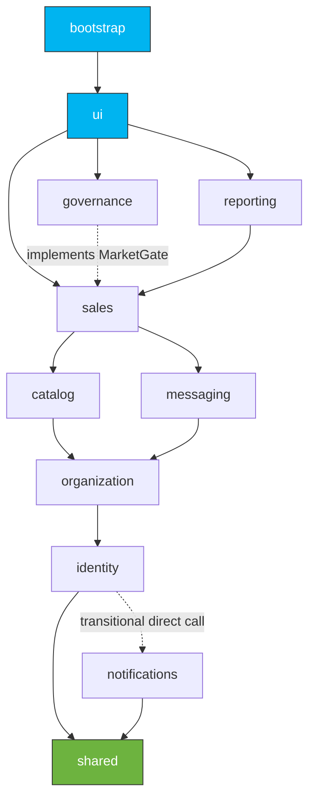

> This project is an extended and upgraded version of [event-ticket-system](https://github.com/AdamSimkinbgu/event-ticket-system),
> originally built by me and collaborators as a university project at Ben-Gurion University.
> Being extended and enhanced by me in this repository.

<div align="center">

# 🎟️ Events Ticketing System

**An event management & ticketing platform where producers create and run events, and buyers browse and purchase tickets — built as a verified, enforced DDD + hexagonal modular monolith.**


</div>

---

## What this is

An event trading platform. **Producers** register production companies, appoint owners and managers
with granular permissions, and create, configure, publish, and cancel events. **Buyers** (registered
members and anonymous guests) browse the open market, reserve seats against a timed hold, and check
out through a real external payment gateway and ticket issuer. A **platform admin** initializes the
system, opens and closes the market, and watches live analytics and integrity checks.

Under the hood it is a **Spring Boot 3.5 / Vaadin Flow 24.7 monolith on Java 21**, deployable on
PostgreSQL (Supabase) and runnable end-to-end locally on in-memory H2 with a seeded demo dataset. The
distinguishing feature is its architecture: **eleven bounded-context modules arranged as a build-verified
acyclic graph**, each following a canonical hexagonal (ports-and-adapters) layout, with boundary and
layering violations failing the build.

### Highlights

- 🏛️ **DDD + hexagonal modular monolith** — 11 Spring Modulith modules; cross-context calls go through **ports and events** rather than reaching into another context's internals (one transitional direct call, `identity → notifications`, remains and is flagged in-code for extraction behind a port).
- ✅ **Enforced architecture** — ArchUnit proves the bounded-context graph is a **DAG** and that hexagonal layers hold; the build fails on any violation. Spring Modulith regenerates C4 diagrams on every test run.
- 🔌 **Dual persistence, one port** — every aggregate has a domain repository port with two adapters (in-memory `ConcurrentHashMap` and JPA/Spring Data), swapped purely by Spring profile.
- 🔒 **Transactions & optimistic concurrency** — `@Transactional` at the application-service layer, `@Version` optimistic locking, commit-time lock failures re-typed into domain exceptions via an AOP aspect.
- 🔁 **Event-driven decoupling** — refunds, event cancellation, and most cross-context reactions flow through domain/integration events (a synchronous `@EventListener`) rather than direct service calls.
- 🚦 **Deterministic platform lifecycle** — a `UNINITIALIZED → READY → OPEN ↔ CLOSED` state machine gated on an external-service quorum and a System Admin.
- 🌱 **Reproducible dev environment** — boot into a known state by replaying real use-case operations from an editable `.scenario` file; a rich demo dataset seeds automatically under the `dev` profile.

---

## Architecture

A **DDD + hexagonal modular monolith**. Each top-level package under `com.ticketing.system` is a
Spring Modulith `@ApplicationModule` (a bounded context). The contexts form a **verified acyclic
dependency graph**, and cross-context interaction crosses the boundary through a **port** (an interface
owned by one side) or an **event** rather than by reaching into another context's domain or adapters.
One transitional exception remains today: `identity` calls `notifications`' `NotificationDispatchService`
directly (flagged in-code to move behind an inbound port).

### The modules

| Module | Responsibility |
|---|---|
| `shared` | **Shared kernel:** the `DomainException` hierarchy, the base `IRepository`/`InvariantChecked` contracts, cross-cutting technical infra (AOP aspects, `RepositoryLocks`, `WsepHttpClient`, security config, metrics), published-language DTOs, the cross-context purchase-policy domain, and integration-event records (`shared/event`). |
| `identity` | User, Session, Admin, authentication. The most foundational context. |
| `organization` | `ProductionCompany` + the `CompanyAppointment` aggregate (company membership, roles, permissions), each with its own repository. |
| `catalog` | Event, venue maps, zones, seats, and **inventory** — owns reserve/release/confirm via `InventoryCommandPort`. |
| `sales` | `ActiveOrder`, `OrderReceipt`, `Ticket`, checkout, reservations, refunds, and purchase policies. The transactional core. |
| `messaging` | Conversations, support inquiries, complaints, and admin outreach. |
| `notifications` | Consumes `shared/event` integration events via a synchronous `@EventListener` adapter; its own dependencies are only the kernel. Still receives one transitional **direct** call (`NotificationDispatchService`) from `identity`/`bootstrap`, pending an inbound port. |
| `governance` | Platform lifecycle, market state, system analytics, and integrity verification. A top-level consumer (the market gate is inverted through a sales-owned `MarketGate` port). |
| `reporting` | The CQRS read side: cross-context read services (member purchase history, company dashboards). Consumed only by the UI. |
| `ui` | The single Vaadin driving adapter — `@Route` views + MVP presenters. No backend bounded context depends on it; only the `bootstrap` composition root references it (wiring). |
| `bootstrap` | The composition root: lifecycle runners, `@Scheduled` sweepers, and the dev seed / `.scenario` engine. A pure sink that wires the contexts together. |

### Dependency graph (a DAG)

This is the **principal dependency spine** — a simplified topological view; the full edge set has more
direct dependencies (e.g. from `bootstrap`/`ui`, and the transitional `identity → notifications`):
`shared ← identity ← organization ← {catalog, messaging} ← sales`, with `governance` and `reporting` as
top-level consumers and `ui`/`bootstrap` as sinks. The graph is acyclic — no two modules depend on each
other, directly or transitively. The authoritative, complete graph is the Modulith-generated
[`docs/architecture/components.puml`](docs/architecture/components.puml).



*(An arrow means "depends on." `governance` implementing sales' `MarketGate` port is how the market
gate is inverted so `governance` stays a top consumer without creating a cycle.)*

### Per-context hexagonal layout

Each backend context uses the canonical ports-and-adapters structure. The single inbound driving
adapter is the shared `ui` module, so contexts hold domain + application + outbound adapters:

```
com.ticketing.system.sales
├── domain/                  # aggregates, value objects, domain events (keep @Entity — jakarta.persistence allowed)
├── application/
│   ├── port/in/             # inbound use-case / query ports
│   ├── port/out/            # outbound driven ports (repositories, gateways, cross-context ports)
│   └── service/             # @Transactional application services implementing the inbound ports
└── adapter/
    └── out/
        ├── persistence/     # Jpa* / Memory* repositories (+ SpringData*) selected by profile
        └── wsep/            # external-system adapters (payment gateway, ticket issuer)
```

### The central pattern — repository ports with dual adapters

Every aggregate has a domain repository port (e.g. `EventRepository`, `UserRepository`,
`ActiveOrderRepository`) extending the base `IRepository<T, ID>`. **Two** adapters implement it,
selected by Spring profile — application code depends only on the port, never on a concrete repository:

- `MemoryXxxRepository` — `@Profile("!jpa")`, `ConcurrentHashMap`-backed. The default.
- `JpaXxxRepository` — `@Profile("jpa")`, adapts the port onto a Spring Data `SpringDataXxxRepository`. The application layer never sees Spring Data types.

One abstract `IXxxRepositoryContractTest` with `Memory…` and `Jpa…` subclasses verifies **both**
backends against the same behavioral contract.

### Transactions & concurrency

- `@Transactional` lives at the **application-service** layer — not in the domain, not in the adapters. External WSEP calls are kept *outside* the DB transaction.
- Concurrency under `jpa` is **optimistic locking** via JPA `@Version` (the Memory adapters' explicit `lockForUpdate`/`unlock` become no-ops). `OptimisticLockTranslationAspect` (`HIGHEST_PRECEDENCE`, so it wraps the transactional advice) re-types a commit-time `OptimisticLockingFailureException` into the domain's `ConcurrentReservationException`.
- `LoggingAspect` traces every public application-service method (entry/exit/throw), logging argument *counts*, never values.

### Enforcement — the architecture is the test

Both gates run on every `./mvnw test` and fail the build on violation:

| Gate | What it proves |
|---|---|
| **`HexagonalRulesTest`** (ArchUnit) | Domain is free of Spring/Vaadin and the outer layers; the application layer never depends on adapters; no backend context depends on `ui`; and **`bounded_contexts_are_acyclic()`** proves the module graph is a DAG (ArchUnit slices — the same cycle engine Modulith uses, run without the open-module exemption, so it is the substantive cycle guarantee). |
| **`ModularityTests`** (Spring Modulith) | `ApplicationModules.verify()` validates the module model, and `Documenter` regenerates the C4 / PlantUML component diagrams and per-module canvases (committed under `docs/architecture/`). |

> Modules are declared *open*, so Modulith validates the model while ArchUnit provides the substantive
> cycle teeth. Closing modules to expose only named-interface ports (type-level encapsulation) is
> documented future work, not a correctness gap.

---

## Tech stack

| Area | Choice |
|---|---|
| Language / build | Java 21, Maven (wrapper: `./mvnw`) |
| Framework | Spring Boot 3.5, Spring Data JPA, Spring AOP, Spring Actuator |
| UI | Vaadin Flow 24.7 (server-side, MVP presenters) |
| Architecture enforcement | Spring Modulith 1.4, ArchUnit 1.4 |
| Persistence | PostgreSQL / Supabase (prod), H2 in-memory (dev & contract tests), in-memory maps (default/test) |
| Auth | JWT (jjwt 0.12.6), BCrypt password hashing |
| External systems | WSEP payment gateway + ticket issuer over HTTP |

---

## Getting started

**Prerequisites:** JDK 21 and the bundled Maven wrapper (`./mvnw`, or `mvnw.cmd` on Windows).

```bash
# Local development — H2 in-memory DB, market auto-opened, demo dataset seeded. Use this by default.
./mvnw spring-boot:run -Dspring-boot.run.profiles=dev

# Production / staging path — activate the jpa profile against PostgreSQL (needs the DB_* env vars below).
# A bare `spring-boot:run` with no active profile selects the in-memory Memory* adapters (@Profile("!jpa")).
SPRING_PROFILES_ACTIVE=jpa ./mvnw spring-boot:run
```

The Vaadin UI serves at **`http://localhost:8080`**. The Maven `production` profile
(`./mvnw -Pproduction ...`) bundles the optimized, minified Vaadin frontend for deployment.

### Tests

```bash
./mvnw test                                             # full suite
./mvnw test -Dtest=ReservationServiceTest               # one class
./mvnw test -Dtest=ReservationServiceTest#reservesSeatedZone   # one method
```

> **Windows caveat:** Vaadin 24.7.0's `prepare-frontend` goal can NPE on Windows. The `-Pno-vaadin`
> profile skips it (`./mvnw -Pno-vaadin test`) — use it for **test runs only**, since the app then
> won't serve Vaadin views.

### Reset / replay the dev dataset

A normal `dev` boot already reseeds — H2 is `create-drop`, so the schema starts empty and
`seed.mode=reseed` replays the demo scenario each run. To force a full wipe + reseed (destructive; needs
the explicit opt-in), or to replay a different initial-state file:

```bash
# Full wipe + reseed (keeps the platform admin). Mainly for a persistent DB — dev's H2 starts empty anyway.
./mvnw spring-boot:run -Dspring-boot.run.profiles=dev \
    -Dspring-boot.run.arguments="--seed.mode=reset --seed.assume-yes=true"

# Replay a specific initial-state file (see "Initial-state files" below)
./mvnw spring-boot:run -Dspring-boot.run.profiles=dev \
    -Dspring-boot.run.arguments="--seed.mode=reseed --seed.scenario=file:/abs/path/your.scenario"
```

See [`SEED.md`](SEED.md) for the full `seed.mode` reference (`off · reseed · wipe · reset · ask`) and the
seeded dataset.

---

## Profiles

| Profile | Effect |
|---|---|
| *(default, no profile)* | Selects the in-memory `Memory*` adapters (`@Profile("!jpa")`). The production config in `application.yml` (PostgreSQL via `DB_*`) applies once `jpa`/`supabase` is activated (e.g. `SPRING_PROFILES_ACTIVE=jpa`). |
| `dev` | Activates `jpa`; H2 in-memory (`create-drop`), demo seeding, market auto-opened. |
| `test` | Used by the suite; disables `PlatformInitializationRunner` so tests drive init. |
| `jpa` | Swaps Memory adapters for Jpa adapters (auto-activated by `dev` and `supabase`). |
| `supabase` | `jpa` against remote Supabase Postgres, env-only credentials (`application-supabase.yml`). |
| `production` / `no-vaadin` | Maven **build** profiles (bundle frontend / skip Vaadin prepare). |

---

## Configuration

All runtime configuration lives in `src/main/resources/application.yml`; every value is env-var
overridable (shown as `${ENV:default}`). Overlays: `application-dev.yml` and `application-supabase.yml`.

### `application.yml`

| Key | Default | Purpose |
|---|---|---|
| `spring.datasource.url` | `jdbc:postgresql://${DB_HOST:localhost}:${DB_PORT:5432}/${DB_NAME:ticketing}` | DB connection (env: `DB_HOST`/`DB_PORT`/`DB_NAME`) |
| `spring.datasource.username` / `password` | `${DB_USER:postgres}` / `${DB_PASSWORD:postgres}` | DB credentials |
| `spring.jpa.hibernate.ddl-auto` | `update` | Schema strategy (prod); Hibernate auto-detects the dialect per connection |
| `spring.profiles.group.dev` / `spring.profiles.group.supabase` | `jpa` | Activating `dev` or `supabase` also activates `jpa` |
| `jwt.secret` | `${JWT_SECRET:…}` | JWT signing secret — **must** be supplied via env in production |
| `session.member-ttl-minutes` | `1440` | Absolute member-session lifetime |
| `session.guest-idle-timeout-minutes` | `30` | Idle timeout for guest sessions |
| `auth.lockout.max-attempts` | `5` | Brute-force lockout threshold (`0` disables) |
| `auth.lockout.lock-minutes` | `15` | Lockout duration |
| `constants.ticket-reservation-duration` | `10` | Reservation hold window (minutes) |
| `constants.order-expiration-duration` | `60` | Active-order expiration (minutes) |
| `analytics.rate-window-minutes` | `5` | Trailing window for analytics rates |
| `analytics.refresh-interval-ms` | `5000` | Dashboard auto-refresh (`0` disables) |
| `management.endpoints.web.exposure.include` | `health,info` | Exposed Actuator endpoints |
| `vaadin.launch-browser` | `false` | Don't auto-open a browser on run |
| `vaadin.allowed-packages` | `com.ticketing.system.ui` | Restrict Vaadin component/route scan |
| `platform.admin.username` / `password` | `${PLATFORM_ADMIN_USERNAME:admin}` / `${PLATFORM_ADMIN_PASSWORD:admin}` | **UC-1 / I.1.4** default admin — **override in production** |
| `wsep.base-url` | `${WSEP_BASE_URL:https://…koyeb.app/}` | WSEP payment/issuance endpoint |
| `wsep.handshake-attempts` / `handshake-backoff-ms` | `3` / `1000` | Retried, idempotent reachability handshake (`pay`/`issue`/`refund` are never retried) |
| `market.self-heal-delay-ms` | `30000` | Interval on which `MarketSelfHealScheduler` re-attempts an open after a transient outage |

### `application-dev.yml`

| Key | Default | Purpose |
|---|---|---|
| `spring.datasource.url` | `jdbc:h2:mem:devdb;…` | In-memory H2 (no Postgres/Docker needed locally) |
| `spring.jpa.hibernate.ddl-auto` | `create-drop` | Drop + recreate schema each boot |
| `seed.scenario` | `classpath:scenarios/demo.scenario` | Initial-state file to replay (see below) |
| `seed.mode` | `reseed` | `off` · `reseed` · `wipe` · `reset` · `ask` (`wipe`/`reset` need `seed.assume-yes=true`) |
| `seed.fail-fast` | `false` | `true` stops at the first unexpected failure |

---

## Platform lifecycle (UC-1 / UC-32)

The platform comes up through a deterministic boot sequence, then waits for an admin to open the
market before any money can move. It is a small state machine:

```
UNINITIALIZED → READY → OPEN ↔ CLOSED
```

1. **`PlatformInitializationRunner`** (`@Order(0)`, skipped under `test`) calls `SystemAdminService.initializePlatform()`.
2. **`initializePlatform()`** (UC-1) runs the I.1 post-conditions in order:
   - **I.1.2 / I.1.3 — external-service quorum:** at least one payment gateway *and* one ticket issuer must answer a WSEP `handshake` (retried, idempotent), else `ExternalServiceUnavailableException`.
   - **I.1.4 — guarantee a System Admin:** `createDefaultAdminIfMissing()` auto-creates the default admin from `platform.admin.*` if none exists, else `MissingDefaultAdminException`.
   - **I.1.1 gate:** re-assert the post-conditions and run the structural integrity scan (`SystemIntegrityVerifier.verify()`), else `InitializationIntegrityException`. The platform transitions to **READY**.
3. The market stays **CLOSED** until an admin calls **`openMarket()`** (UC-32), which re-verifies the external services and structural invariants before flipping to **OPEN**. `ReservationService` / `CheckoutService` are gated on `isMarketOpen()` (via the sales-owned `MarketGate` port).
4. Under `dev`, **`DevMarketOpener`** (`@Order(1)`) opens the market automatically so the seeded scenario can transact. If a transient outage leaves it closed, `MarketSelfHealScheduler` re-attempts the open on `market.self-heal-delay-ms` until it succeeds — no restart needed.

> Initialization failures are logged but do not currently abort the JVM (the process boots; the market
> just can't open). A hard boot-validity check that fails startup on invalid init is tracked in
> **#367 (V3-INIT-02)**.

---

## Persistent cart (UC-13)

A member's Active Order (cart) persists by `userId` across logout and is restored on re-authentication
within the reservation window. On login, `AuthenticationService` re-attaches the persisted cart (or
promotes a guest cart) via the identity→sales `CartRestorationPort`, and `ReservationService`
rehydrates it with the remaining timer (II.3.0.2 / UC-13). Expired carts are released back to inventory
by the scheduled `SessionAndOrderSweeper` (II.3.0.3) and are not restored.

---

## Initial-state files (`.scenario`)

The platform can boot into a known state from an editable text file that **replays a sequence of
use-case operations through the real application services** — one operation per line. Two samples ship
under `src/main/resources/scenarios/`: `demo.scenario` (rich dataset) and `review.scenario` (minimal
baseline). The engine (`bootstrap/dev/seed/scenario/ScenarioRunner`) is present on every non-`test`
profile but **inert unless `seed.mode` is set to something other than `off`** (`off` is the default), so
it never touches prod/cloud unless explicitly asked; `dev` sets `seed.mode=reseed`.

### Syntax

- One operation per line; blank lines and lines starting with `#` are ignored.
- Tokens are whitespace-separated; wrap values containing spaces in `"double quotes"`.
- The first token is the operation; remaining bare tokens are **positional** args; `key=value` tokens are **named** args.
- Refer to users/companies/events by short **aliases** (`u1`, `p1`, `e1`); the engine maps each alias to the real id the service mints.

### Operations

Each operation dispatches to a real application-service method (`bootstrap/dev/seed/scenario/ScenarioOps`):

| Operation | Application-service call |
|---|---|
| `register <alias> <password> <email> <age>` | `AuthenticationService.register` |
| `login <alias>` | `AuthenticationService.login` |
| `login-admin <alias> <username> <password>` | `AuthenticationService.signInAsAdmin` |
| `logout <alias>` / `logout-all` | `AuthenticationService.logout` |
| `guest <alias>` | `AuthenticationService.startGuestSession` |
| `open-company <owner> <companyAlias> "<name>" ["<desc>"]` | `CompanyManagementService.registerCompany` |
| `appoint-owner <by> <company> <target>` | `CompanyManagementService.appointOwner` |
| `appoint-manager <by> <company> <target> perms=A,B,C` | `CompanyManagementService.appointManager` |
| `confirm <alias> <company>` | `CompanyManagementService.respondToAppointment` |
| `add-event <by> <company> <eventAlias> <zone>… [name= category= city= days= publish=]` | `EventManagementService.addEvent` + `configureVenueMap` (+ `publishEvent`) |
| `publish <by> <company> <event>` | `EventManagementService.publishEvent` |
| `reserve <buyer> <event> <zoneRef> qty=<n> \| seats=A1,A2` | `ReservationService.reserveForMember` / `reserveForGuest` |
| `checkout <buyer> [email= age=]` | `CheckoutService.checkoutMember` / `checkoutGuest` |
| `cancel-event <by> <event>` | `EventManagementService.cancelEventAndRefund` |
| `contact-company <from> <company> subject= body=` | `MessagingService.startConversation` |
| `submit-complaint <from> subject= body=` | `MessagingService.submitComplaint` |
| `announce <admin> title= body= [audience=BROADCAST_MEMBERS\|BROADCAST_PRODUCERS]` | `MessagingService.sendOutreach` |
| `assert-status <event> <STATUS> by=<owner>` | read-only assertion via `EventManagementService.getEventDetail` |
| `expect-error <op> <args…>` | negative test — passes only if the wrapped op throws |

Manager permissions (`perms=`) are any of `CONFIGURE_VENUE`, `MANAGE_INVENTORY`, `EDIT_POLICIES`,
`VIEW_SALES`, `RESPOND_TO_INQUIRIES`. Zone specs for `add-event` are `standing:<capacity>@<price>` or
`seated:<rows>x<cols>@<price>` (e.g. `standing:30@50`, `seated:10x10@100`).

### Example (`review.scenario`)

```text
register u1 password123 u1@demo.test 30
login u1
open-company u1 p1 "Production Company p1"
appoint-owner u1 p1 u2
login u2
confirm u2 p1
appoint-manager u2 p1 u3 perms=CONFIGURE_VENUE
login u3
confirm u3 p1
add-event u2 p1 e1 standing:30@50 seated:10x10@100 name="e1"
logout-all
```

Each line is classified `PASS` / `SKIPPED` / `FAIL` / `BLOCKED`, and a summary report is logged at the
end. With `seed.fail-fast=true` the run aborts (and reports) on the first unexpected failure, which
satisfies the "init fails if any step fails" requirement.

---

## Testing

`src/test/.../` mirrors the production layout:

| Suite | Scope |
|---|---|
| `unit/domain`, `unit/application`, `unit/infrastructure` | Fast, isolated unit tests (`@ActiveProfiles("test")`, Memory repos) |
| `acceptance/` | Full `@SpringBootTest` use-case flows |
| `integration/` | `@DataJpaTest` / JPA against H2 (contract tests run both Memory and Jpa backends) |
| `concurrency/` | Optimistic-locking / oversell guards under contention |
| `architecture/` | `HexagonalRulesTest` + `ModularityTests` — the enforced boundary and layering gates |

`*IT` classes are integration tests against a real local Postgres.

---

## Requirement traceability

Code and Javadoc reference requirement / use-case IDs (`UC-1`, `I.1.4`, `SLR.6`, `II.3.0.x`) and open
tickets (`#367`, `V3-INIT-02`). These references are preserved when editing and cited when adding
behavior tied to a requirement.

---

## Further reading

- **`docs/architecture/`** — the committed Spring Modulith C4 / PlantUML component diagrams and per-module canvases (regenerated on every `./mvnw test`). Start with `docs/architecture/README.md`.
- **`SEED.md`** — the `dev` demo dataset (users, companies, events), seeded credentials, and `seed.mode` behavior.
